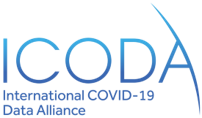

# Federated Data Sharing Common API

## Introduction

This repository contains OpenAPI definitions for the Common API for Federated Data Sharing. The Common API was developed to facilitate collaboration and trusted data sharing networks between trusted research environments and data providers.

## Documentation

- [API Overview](./doc/API_Overview.md)
- [User Guide](./doc/User_Guide.md)
- Reference implementation - Coming Soon
- [Origins](./doc/Origins.md)

A separate repository provides [Worked examples](https://github.com/federated-data-sharing/common-api-examples)

<table>
    <tr>
        <td valign="top">
**For Data providers**

A data provider may be an existing data repository or platform, or groups managing research data at their institutions. They have complex and varying data governance constraints and technical capabiliities which means that contributing data to research projects or more data sharing in a network may be difficult. 

The Common API approach allows data providers to choose how they join a collaboration network.

- Level 0: transferring data directly for hosting to a trusted research environment (TRE)
- Level 1: providing remote access to data
- Level 2: providing a  data providers and data users in biomedical reserach 

Level 0 is provided by a TRE, while data providers must implement Level 1 or Level 2 using their own infrastructure.

Data providers are often in multiple collaborations at the same time. Investment in a Level 1 and Level 2 implementation can be repurposed for more than one network.
        </td>
        <td valign="top">
**For Data users**

A researcher or group of researchers working with multiple data sources have to navigate varying access mechanisms and APIs. By working in a network with data providers that implement the Common API, they can use their favourite tools to query, compute and analyse data in a consistent and efficient way. 

The Common API allows users to:

- Find data and detailed metadata about available data sources
- Define selections and filters on data
- Retrieve record level data (Level 1) or compute over record level data using containerised scripts (Level 2) 

Currently the API is geared at users within a research team who can program. We expect in time that graphical user interfaces will be built or adapted that take advantage of the standard and reach a wider audience more directly.
        </td>
    </tr>
</table>

> A reference implementation is being developed to facilitate the technical choices for data providers.

## Partners

The Common API is an open source co-development between a number of partner organisations

&nbsp;&nbsp;&nbsp;&nbsp;
 
&nbsp;&nbsp;&nbsp;&nbsp;
 
&nbsp;&nbsp;&nbsp;&nbsp;
 

## Acknowledgments

The Common API gratefully builds on work from standardisation communities:  

- [World Wide Web Consortium (W3C)](https://www.w3.org/)
- [GraphQL Foundation](https://foundation.graphql.org/)
- [Global Alliance for Genomics and Health (GA4GH)](https://www.ga4gh.org/)
- [IETF](https://www.ietf.org/) OAuth Working Group - see https://oauth.net/2/

## Contributing

The code is licensed under the [Mozilla Public License 2.0](https://www.mozilla.org/en-US/MPL/2.0/) see [LICENSE](./LICENSE). 

The project was [originally](./doc/Origins.md) part of an international collaboration on sharing data in clinical research. We now welcome contributions from a wider community. As more organisations are joining the effort, a new governance process will be established. In the meantime, please contact the [maintainers of the repository](mailto:info@fds-api.org).

