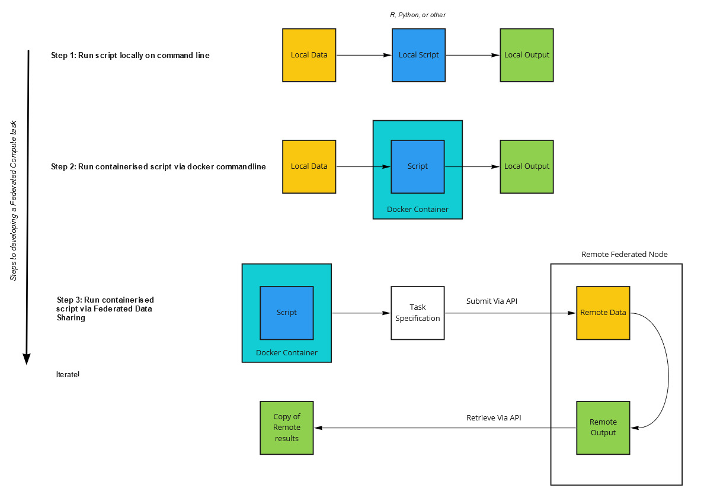
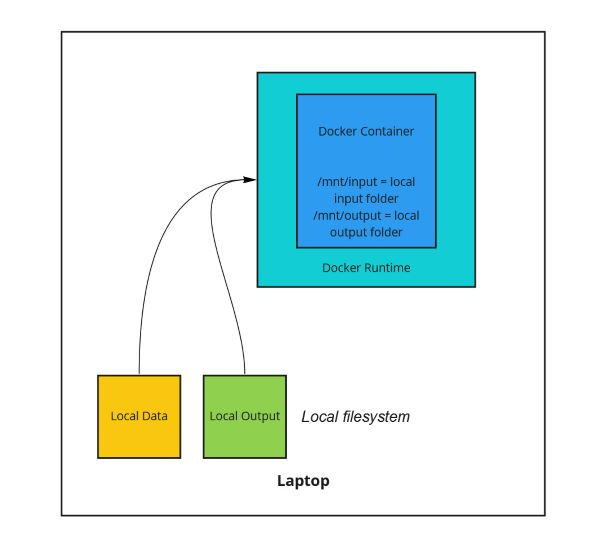
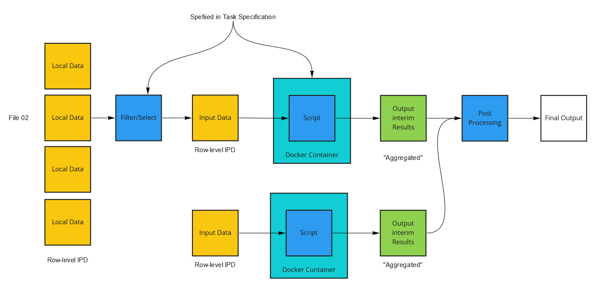

# Containerising a script as a federated compute task

> Back to the [main page](./User_Guide.md)

## Getting started

In order to execute a remote computation task, your analysis code must be packaged up in a docker container. 

> For simplicity we use the word "script" for this code as this is common data science but your container could be any program that can be run in a docker container, including complex programmes with library or package dependencies all encapsulated within the container.

## Workflow

In order to containerise the script, it is recommended to go through the following steps:

1. Run the script on dummy or synthetic data on the command line on your local machine
2. Package up the script in a container and run using local docker installation, via command line on your local machine
3. Run the containerised script on one or more remote site via Federated Data Sharing API

A set of conventions set out how you should expect inputs to your containers or outputs of your computation to be handled. In the base, simple case your script should *read* one or more input CSV files corresponding to your selection query from a specified folder (`/mnt/input`) which may be read-only. Your script is then able to *write* one or more files to a specified folder (`/mnt/ouput`).

Federated analysis can be run on more than one node or site. When running a federated task in that more complex scenario, the same container might be used across multiple sites, or a selection filter might process only some of the data available at a given site. In this case it is important to consider a two stage process:

- distribute the code to each site and obtain intermediate results
- combine data in a post-processing step

The 'post-processing' step is what produced the final output you are aiming for:

## Next steps

Try the API using:

- [Command Line](./User_Guide_CLI.md) tools - e.g. with `curl`
- [Python](./User_Guide_Python.md)
- [R](./User_Guide_R.md)
